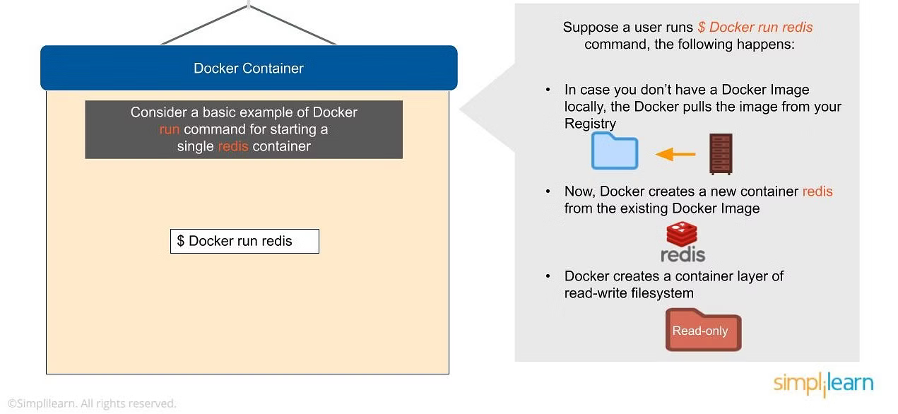

## Container: A docker container image is a lightweight, standalone, executable package of software that includes everything needed to run an application.

## Container vs container images:
1. container images: all the dependency are inside it.
2. container: we run those dependency from container.

## Open Container Initiative (OCI):
OCI is an open governance structure for the express purpose of creating open industry standards around container formats and runtimes.

1. RunTime Specification.
2. Image Specification.
3. Distribution Specification.

## Container vs Virtualization
1. virtualization means creating copy of host.
2. Container means sharing host.

## Docker:
1. What is docker: Docker is OS virtualised Software platform that allows IT organizations to quickly create, deploy, and run applications in Docker container, which have all the dependencies within them, the container itself is a very lightwheigh package with all the instructions and dependencies -such as framework, libraries, and bins within it.

2. Advantages and Components of Docker

## Virtual environment has a supervisor layer, whereas Docker has a Docker engine layer.

## VM, the memory usage is very high, whereas, in a Docker environment, memory usage is very low.

## How Does Docker Work?
==> Docker works via a Docker engine that is composed of two key elements: a server and a client; and the communication between the two is via REST API. The server communicates the instructions to the client. 

## Components of Docker:
a. Docker client and server: Communication b/w docker client and docker host is via a REST API.

b. Docker image
c. Docker registry
d. Docker container

## Docker Daemon: 
A persistent background process that manages docker images, container, networks, and storage volumes. Docker daemon constantly listens for Docker API requests and processes them, docker pull command, which would send an instruction to the daemon and perform the operation by interacting with other components(image, container, registry).

## Docker Daemon: 
itself is actually a server that interacts with the OS and perform services.

## Docker Image:
 docker image is built within the YAML file and then hosted as a file in the docker registry, the image has several key layers, and each layer depends on the layer below it. Image layers are created by executing each command in the Dockerfile and are in the read-only format,  you can start with your base layer, which will typically have your base image and your base OS, and then you will have a layer of dependencies above that. these then comprise the instructions in a read-only file that would become your dockerfile.

## Here we have 4 Layers of instructions: From, Pull, Run and CMD.
## Pull: Adds files from your docker repo.
## Run: Builds your container.
## CMD: Specifies which command to run within the container.

## Docker registry: 
Docker registry is where you would host various types of images and where you ld distribute the images from. The repo itself is just a collections of Docker images, which are built on instructions written in YAML and are very easily stored and shared.
3. Docker container:
## Docker container: 
it's an executable package of applications and its dependencies bundled together; it gives all the instructions for the solutions, it's lightweight due to the built-in structural redundancy.
 
 ## Benegits of docker container:
 a. Light-weight
 b. Application run in isolations
 c. occupies less space
 d. Easily portable and highly secure.
 e. short boot-up time.

## Ten Steps to using Docker container:
    1. Moving the container infrastructure to the cloud
    2. Monitoring our environment
    3. Configuring the system
    4. Adding Vault
    5. Run Application  ## docker-compose run app
    6. start Machine
    7. Deploy machine ## docker-compose up -d
    8. restarting machine ## docker-compose down -d
    9. view state ## docker-compose ps
    10. Inspect /vault/code ## docker-compose exec /vault/code

## Advanced Docker Components:
==> Docker Compose: 
==> Docker Swamp:
4. Docker vs VM

5. DockerFile
## DockerFile:
Docker tool is a vital part of configuration management tool in most of the global companies. Docker tool runs an application with the help of dockerfile with a high level of abstraction and security.
## Before dockerfile, first understand docker image:
Docker image is a read-only file with a bunch of instructions. when these instructions are executed, it creates a docker container.
DockerFile: is a simple text file that consists of instruction to build docker images.
## To create dockerfile, its important to understand what makes up the file.
Dockerfile consists of commands that guide you on how to build specific docker image.
## Specific commands you can can use in dockerfile are: FROM, PULL, RUN, and CMD.
 FROM: create a layer from the ubuntu.
 PULL: Adds files from your docker repo.
 RUN: Builds you container.
 CMD: Specifies what command to run within the container.

## How to build docker image and docker container using dockerfile.
a. create directory:
mkdir sample
b. move docker image into the directory:
cd sample
c. create dockerfile
touch Dockerfile
d. open dockerfile
vi Dockerfile
e. then, add the following content:
FROM ubuntu
MAINTAINER simpli
RUN apt-get update
CMD ["echo", "Welcome to simple"]
f. save and exit the file
g. Build Docker image with dockerfile:
docker build [OPTIONS]PATH|URL|-
docker build -t simple_image
ONCE docker image is created, you can verify by executing the commmand.
docker images

## Now create a new container from image:
docker run --name simple simple_image
it will give output

6. Docker compose
## Docker compose 
it's designed for running multiple containers as a single service. it does so by running each container in isolation but allowing the container to interact with one another.
## Docker compose can connect different containers as a single service.
Docker compose is used for running multiple containers as a single service. docker compose files are very easy to write in a scripting language called YAML.
## NOTE: with the help of Docker compose we can activate all the services(container) using a single command.
## Benefits of Docker compose:
    1. Single Host deployement
    2. Quick and easy configurations
    3. High Productivity
    4. Security

## Basic Commands in Docker compose:
    1. Start all services: Docker Compose up
    2. Stop all services: Docker Compose down
    3. Install Docker compose using pip: pip install -U Docker-compose
    4. Check the version of Docker compose: Docker-compose-v
    5. Run Docker compose file: Docker-compose up -d
    6. List the entire process: Docker ps
    7. use YAML file to configure application services -Docker Compose.yml

## Installing Docker compose:
        1. mkdir -p ~/.docker/cli-plugins/
        2. curl -SL https://github.com/docker/compose/releases/download/v2.3.3/docker-compose-linux-x86_64 -o ~/.docker/cli-plugins/docker-compose
        3. chmod +x ~/.docker/cli-plugins/docker-compose
        4. docker compose version

## Create The Compose file:
*** Follow the below steps to create this file:
        1. Create a file called docker-compose.yml at the rool of the project
        2. then define version of the schema
        3. To run as part of our application, we define the list of containers or services in services: sections-
        example:
        version: ""
        services:
        
        etc
7. Working of Docker Swarm
## What is Docker SWARM: MODES, Working:
To understand swarm, first understand docker.
Docker is a tool used to automate the deployment of an application as a lightweight container so that the application can work efficiently in differenct environments.

## Docker Swarm:
it's a service for containers that allow IT administrators and developers to create and manage a cluster of swarm nodes within the Docker platform. Each node of Docker swarm is a docker daemon, and all docker daemon interact using the DOCKER API.

## Swarm consists of 2 type of nodes: a. manager node and another worker node.
A manager node maintains cluster management task, worker node receive and execute tasks from the manager node.

## What is docker swarm?
Docker swarm is an orchestration management tool that runs on Docker applications. It helps end-users in creating and deploying a cluster of Docker nodes.
Each node of a docker swarm is a docker daemon, and all docker daemon interact using the Docker API. Each container within the swarm can be deployed and accessed by nodes of the same cluster.

## 5 Critical Elements within a docker environments.
        1. Docker Container
        2. Docker Daemon
        3. Docker images
        4. Docker client
        5. Docker registry

## If one of the container fails, we can use the SWARM to correct that failure.

Docker Swarm can reschedule container on node failures, swarm node has a backup folder which can use to restore the data onto a new swarm.

## Feature of Docker Swarm:
        1. Decentralized Access
        2. High Security
        3. Autoload Balancing
        4. High Scalability
        5. Roll-back a task

## Swarm Mode Key Concepts
        ## Service and Task
        1. Docker containers are launched using services
        2. Services can be deployed in 2 differnet ways-global and replicated.

        3. Global services are responsible for monitoring containers that want to run on a swarm node. In contrast, replicated services specify the number of identical tasks that a developer requires on the host machine.
        4. Services enable developers to scale their applications.
        5. Before deploying a service in swarm, the developer should implement at least a single node.
        6. Services can be used and accessed by any node of same cluster.
        7. A service is a description of a task, whereas a task preforms the work.
        8. Docker helps a developer in creating services, which can start tasks, however, when a task is assigned to a node, the same task cannot be attributed to another node.
         
## Node:
        1. A swarm node is an instance of docker engine.
        2. it is possible to run multiple nodes on a single server, but in production deployments, nodes are distributes across various devices.

## How does docker swarm work?
In swarm, containers are launched using services, a service is a group of containers of the same image that enables the scalling of applications. Before you can deploy a service in Docker Swarm, you must have at least one node deployed.
    ## There are 2 type of node in docker swarm.
    1. Manager Node: Maintains cluster management tools
    2. Worker node: Receives and execute tasks from the manager node.
Manager node knows the status of the worker nodes in a cluster.
And worker nodes accept tasks sent from the manager node. every worker node has an agent that reports on the state of node's tasks to the manager. this way manager node can maintain the desire state of cluster.

Worker nodes communicate with the manager node using API over HTTP. Docker swarm, services can be deployed and accessed by any node of the same cluster.

## Docker Desktop isn't docker (docker engine).

## Docker consists of Docker Engine, Docker Compose, Docker CLI client, Docker Content Trust, Kubernetes, and Credential Helper.

8. Docker Networking

Docker networking enables a user to link a docker container to as many networks as he/she requires. Docker networks are used to provide complete isolation for docker container.

NOTE: A user can add container to more than one network.

## Advantages of Docker Networking:
1. They share a single OS and maintain container in an isolated environment.
2. It requires fewer OS instances to run the workload.
3. It helps in the fast delivery of s/w
4. It helps in application portability.

## How does docker networking work?
* Docker file builds the docker image.
* Docker image is a template with instructions, which is used to build docker containers.
* Docker has its own cloud based registry called Docker Hub. Where users store and distribute container images.
* Docker container is an executable package of an application and its dependencies together. Functionalities of the different components.
* Docker file has the responsibility of building a doker image using the build command.

* Docker image contains all the project's code.
* using docker image, any user can run the code to create docker containers.
* Once docker image is built, it's either uploaded in a registry or a Docker Hub.

## Container Network Model.
It help you to build and deploy your application in the Docker Tool.

## Network Sandbox:
* It is an isolated sandbox that holds the network configuration of containers.
* Sandbox is created when a user requests to generate an endpoint on the network.

     

Endpoints 

    It can have several endpoints in a network, as it represents a container’s network configuration such as IP-address, MAC-address, DNS, etc.
    The endpoint establishes the connectivity for container services (within a network) with other services
    It helps in providing connectivity among the endpoints that belong to the same network and isolate them from the rest. So, whenever a network is created, or configuration is changed, the corresponding Network Driver will be notified with an event

Docker Engine

    It is the base engine installed on your host machine to build and run containers using Docker components and services
    Its task is to manage the network with multiple drivers
    It provides the entry-point into libnetwork to maintain networks, whereas libnetwork supports multiple virtual drivers

Network Drivers

Docker supports networking for its containers via network drivers. These drivers have several network drivers.

    Bridge
    Host
    None
    Overlay
    Macvlan

Bridge

    It is a private default network created on the host
    Containers linked to this network have an internal IP address through which they communicate with each other easily
    The Docker server (daemon) creates a virtual ethernet bridge docker0 that operates automatically, by delivering packets among various network interfaces
    These are widely used when applications are executed in a standalone container 

Host

    It is a public network
    It utilizes the host’s IP address and TCP port space to display the services running inside the container
    It effectively disables network isolation between the docker host and the docker containers, which means using this network driver a user will be unable to run multiple containers on the same host

None

    In this network driver, the Docker containers will neither have any access to external networks nor will it be able to communicate with other containers
    This option is used when a user wants to disable the networking access to a container 
    In simple terms, None is called a loopback interface, which means it has no external network interfaces 

Overlay

    This is utilized for creating an internal private network to the Docker nodes in the Docker swarm cluster
    Note: Docker Swarm is a service for containers which facilitates developer teams to build and manage a cluster of swarm nodes within the Docker platform
    It is an important network driver in Docker networking. It helps in providing the interaction between the stand-alone container and the Docker swarm service

Macvlan

    It simplifies the communication process between containers
    This network assigns a MAC address to the Docker container. With this Mac address, the Docker server (daemon) routes the network traffic to a router
    Note: Docker Daemon is a server which interacts with the operating system and performs all kind of services

    It is suitable when a user wants to directly connect the container to the physical network rather than the Docker host

Basic Docker Networking Commands

    List down the Networks associated with Docker 

docker network ls 

The above command displays all the networks available on the Docker ecosystem

    Connect a Running Container to a Network

$ docker network connect multi-host-network container

In the command shown above, You can also use the docker network option to start a container and immediately connect it to multiple host networks.

    Specify the IP Address that you want to assign to the Container 

$ docker network connect --IP 10.10.36.122 multi-host-network container

In the above command, a user can specify the IP address (for example, 10.10.36.122) that he/she wants to assign to the container interface.

    Create a Network alias for a Container

$ docker network connect --alias db --alias mysql multi-host-network container2

    Disconnect a Container from a Network

$ docker network disconnect multi-host-network container1

In the above command, the disconnect option is used to stop the running docker containers on multiple host network

    Remove a Network

$ docker network rm network_name

In the above command, the rm option is used to remove a network from the Docker ecosystem

    Remove Multiple Network

$ docker network rm 3695c422697f network_name

The above command can be used when a user wants to remove multiple networks at a time 

    Remove all Unused Networks

$ docker network prune

The above ‘prune’ command can be used when a user wants to remove all unused networks at a time 

